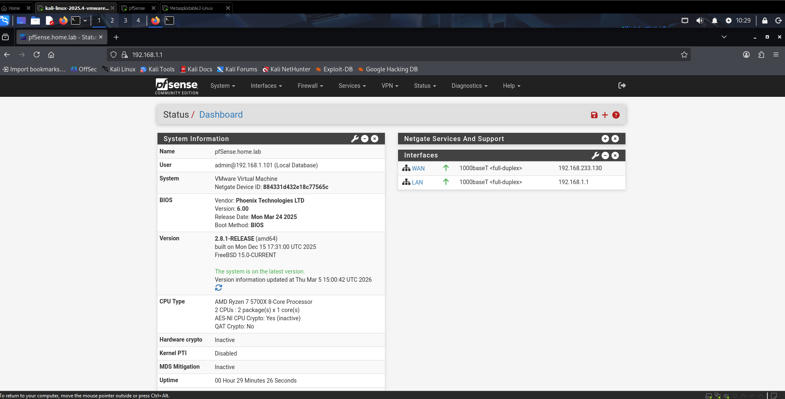
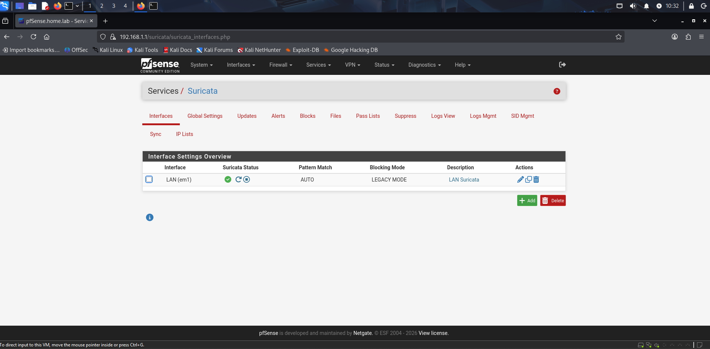
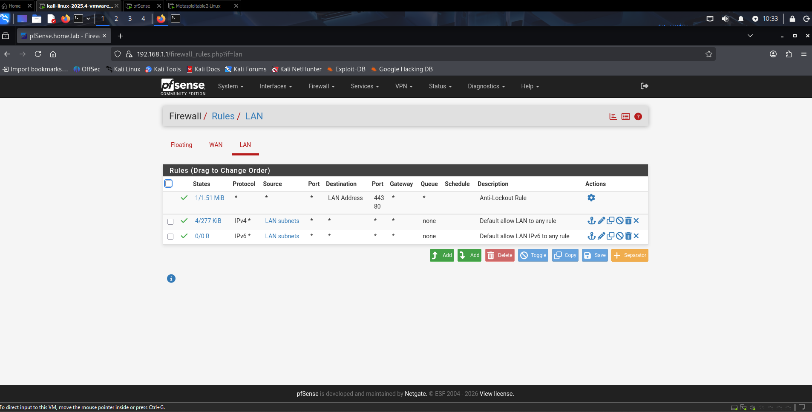
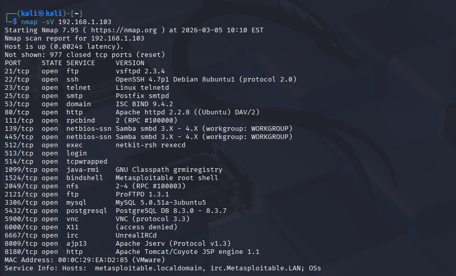
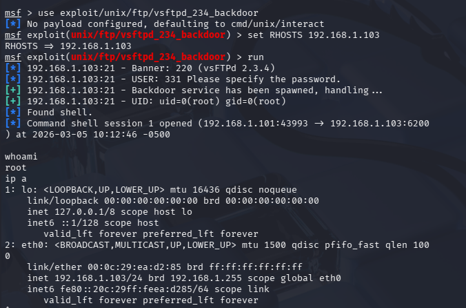
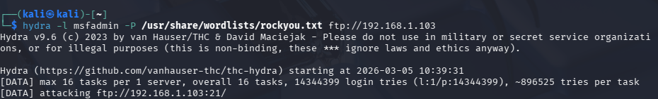
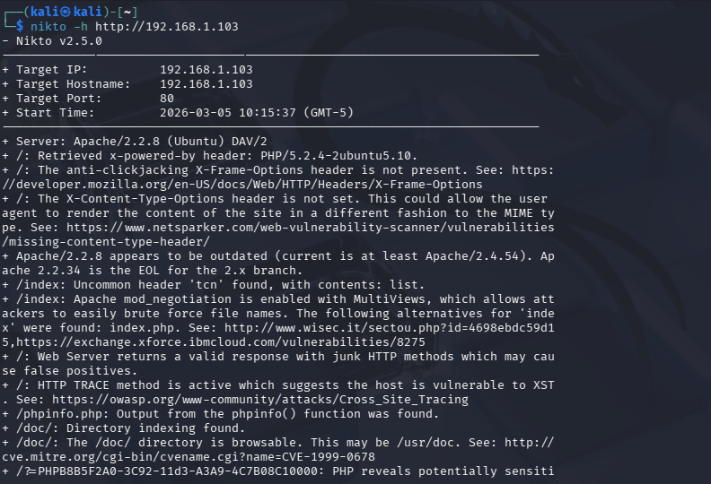
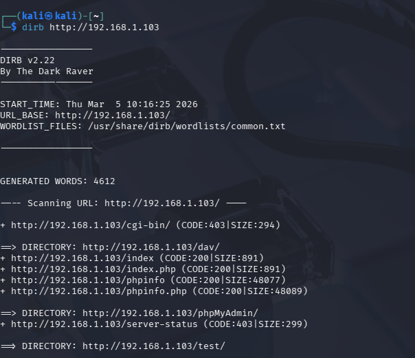
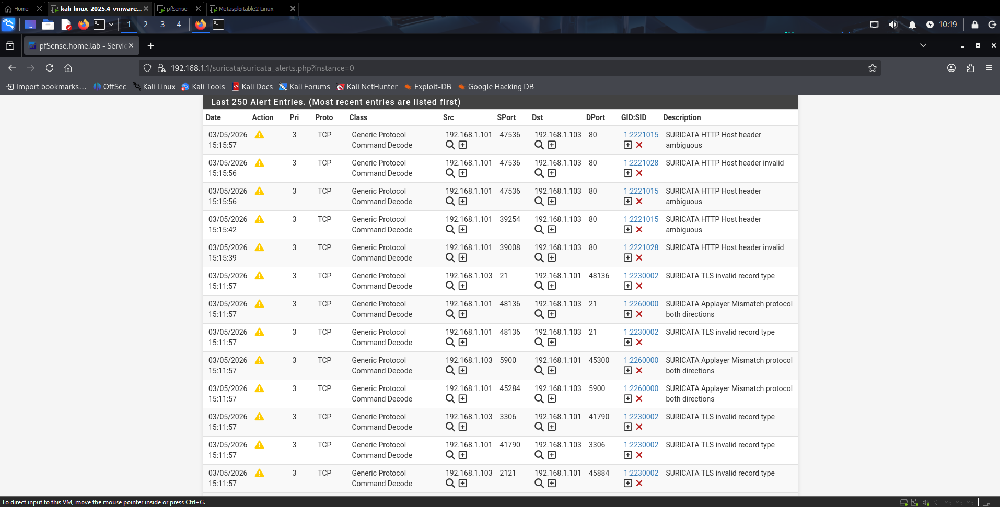
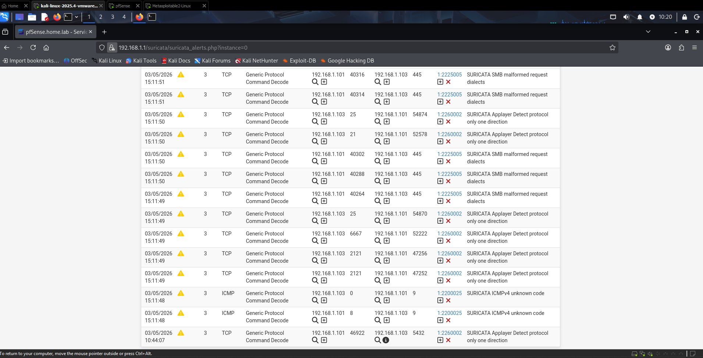

# 🛡️ Home Security Lab — pfSense + Suricata + Kali Linux


> A fully isolated virtual network security laboratory for practicing penetration testing, firewall management, and intrusion detection in a safe, controlled environment.

---

## 📋 Table of Contents

- [Overview](#overview)
- [Architecture](#architecture)
- [Technologies Used](#technologies-used)
- [Lab Setup](#lab-setup)
- [Key Skills Demonstrated](#key-skills-demonstrated)
- [Attack Scenarios](#attack-scenarios)
- [Suricata Alerts](#suricata-alerts)
- [Screenshots](#screenshots)
- [Future Improvements](#future-improvements)

---

## Overview

This project demonstrates the setup and operation of a virtualized cybersecurity home laboratory. The lab simulates a real-world network environment with a perimeter firewall, intrusion detection system, an attacker machine, and a vulnerable target — all isolated from the host network.

**Goals:**
- Practice network penetration testing techniques
- Learn firewall configuration and traffic management with pfSense
- Deploy and tune an IDS/IPS system (Suricata)
- Analyze network traffic and security alerts in real time

---

## Architecture

```
┌─────────────────────────────────────────────────────┐
│                    HOST MACHINE                      │
│                                                      │
│   ┌─────────────────────────────────────────────┐   │
│   │           VMware Workstation Pro             │   │
│   │                                              │   │
│   │  [Internet / NAT]                            │   │
│   │       │  VMnet8 (NAT)                        │   │
│   │       │                                      │   │
│   │  ┌────▼──────────────┐                       │   │
│   │  │     pfSense        │  ← Firewall + Router  │   │
│   │  │  WAN: 192.168.233.130 (VMnet8)            │   │
│   │  │  LAN: 192.168.1.1     (VMnet1)            │   │
│   │  │  IDS: Suricata                            │   │
│   │  └────┬──────────────┘                       │   │
│   │       │  VMnet1 (Host-only, isolated)        │   │
│   │       │                                      │   │
│   │  ┌────┴──────────────────────────┐           │   │
│   │  │        Internal Network        │           │   │
│   │  │  192.168.1.0/24               │           │   │
│   │  │                               │           │   │
│   │  │  ┌───────────┐ ┌───────────┐  │           │   │
│   │  │  │   Kali    │ │Metasploit-│  │           │   │
│   │  │  │  Linux    │ │  able 2   │  │           │   │
│   │  │  │.1.101     │ │  .1.103   │  │           │   │
│   │  │  │ Attacker  │ │  Target   │  │           │   │
│   │  │  └───────────┘ └───────────┘  │           │   │
│   │  └───────────────────────────────┘           │   │
│   └─────────────────────────────────────────────┘   │
└─────────────────────────────────────────────────────┘
```

| Virtual Machine | IP Address | Role |
|----------------|-----------|------|
| pfSense | 192.168.1.1 (LAN) / 192.168.233.130 (WAN) | Firewall, Router, IDS |
| Kali Linux | 192.168.1.101 | Attacker / Penetration Tester |
| Metasploitable 2 | 192.168.1.103 | Vulnerable Target |

---

## Technologies Used

| Technology | Purpose |
|-----------|---------|
| **VMware Workstation Pro** | Hypervisor — runs all virtual machines |
| **pfSense** | Open-source firewall and router (FreeBSD-based) |
| **Suricata** | Network IDS/IPS — detects and blocks attacks |
| **Kali Linux** | Penetration testing distribution |
| **Metasploitable 2** | Intentionally vulnerable Linux target |
| **Nmap** | Network scanner and port discovery |
| **Metasploit Framework** | Exploitation framework |
| **Wireshark** | Packet capture and traffic analysis |

---

## Lab Setup

### Prerequisites
- VMware Workstation Pro
- pfSense ISO — [download](https://www.pfsense.org/download/)
- Kali Linux ISO — [download](https://www.kali.org/get-kali/)
- Metasploitable 2 — [download](https://sourceforge.net/projects/metasploitable/)

### Network Configuration

**VMware Virtual Networks:**
```
VMnet1 — Host-only (no DHCP) → Internal LAN
VMnet8 — NAT (DHCP enabled)  → WAN / Internet
```

**pfSense Interface Assignment:**
```
em0 (Adapter 1 → VMnet1) → WAN: DHCP from VMware NAT
em1 (Adapter 2 → VMnet8) → LAN: 192.168.1.1/24, DHCP 192.168.1.100-200
```

**pfSense Advanced Settings (required for Suricata):**
```
System → Advanced → Networking:
  ✅ Disable Hardware Checksum Offloading
  ✅ Disable Hardware TCP Segmentation Offloading
  ✅ Disable Hardware Large Receive Offloading
```

### Suricata IDS/IPS Setup
```
1. System → Package Manager → Install Suricata
2. Services → Suricata → Global Settings:
   ✅ ETOpen Emerging Threats Rules
   ✅ Snort GPLv2 Community Rules
3. Services → Suricata → Updates → Update Rules
4. Services → Suricata → Interfaces → Add LAN → Start
```

---

## Key Skills Demonstrated

- ✅ **Network Architecture Design** — Designed and implemented a segmented virtual network with DMZ-like isolation
- ✅ **Firewall Configuration** — Configured pfSense with WAN/LAN interfaces, NAT, DHCP, and firewall rules
- ✅ **Intrusion Detection** — Deployed Suricata IDS with ETOpen and Snort community rulesets
- ✅ **Penetration Testing** — Conducted reconnaissance and vulnerability scanning with Nmap against Metasploitable 2
- ✅ **Traffic Analysis** — Monitored and analyzed network alerts generated by simulated attacks
- ✅ **Virtualization** — Managed multi-VM environment with custom virtual network topology in VMware Workstation Pro

---

## Attack Scenarios

### 1. Network Reconnaissance (Nmap)
```bash
nmap -sV 192.168.1.103
```
**Result:** 23 open ports discovered including FTP (vsftpd 2.3.4), SSH, HTTP (Apache 2.2.8), SMB, MySQL, PostgreSQL, VNC, IRC and more.

### 2. Web Vulnerability Scan (Nikto)
```bash
nikto -h http://192.168.1.103
```
**Result:** Detected outdated Apache 2.2.8, missing security headers (X-Frame-Options, X-Content-Type), HTTP TRACE enabled (XST vulnerability), phpinfo.php exposed, directory indexing enabled.

### 3. Directory Enumeration (Dirb)
```bash
dirb http://192.168.1.103
```
**Result:** Discovered `/phpMyAdmin/`, `/cgi-bin/`, `/dav/`, `/test/`, `phpinfo.php` — all critical exposure points.

### 4. Exploitation (Metasploit — vsftpd 2.3.4 Backdoor)
```bash
msfconsole
use exploit/unix/ftp/vsftpd_234_backdoor
set RHOSTS 192.168.1.103
run
```
**Result:** ✅ Root shell obtained — `uid=0(root) gid=0(root)`. Full system compromise demonstrated.

### 5. Brute Force (Hydra — FTP)
```bash
hydra -l msfadmin -P /usr/share/wordlists/rockyou.txt ftp://192.168.1.103
```
**Result:** Brute force attack launched against FTP service with 14,344,399 password combinations.

---

## Suricata Alerts

Alerts captured during attack simulations:

| Timestamp | Proto | Source | Destination | Alert |
|-----------|-------|--------|-------------|-------|
| 03/05/2026 10:44:07 | TCP | 192.168.1.101:46922 | 192.168.1.103:5432 | SURICATA Applayer Detect protocol only one direction |
| 03/05/2026 15:11:48 | ICMP | 192.168.1.101 | 192.168.1.103 | SURICATA ICMPv4 unknown code |
| 03/05/2026 15:11:49 | TCP | 192.168.1.101 | 192.168.1.103:445 | SURICATA SMB malformed request dialects |
| 03/05/2026 15:11:57 | TCP | 192.168.1.101:48136 | 192.168.1.103:21 | SURICATA TLS invalid record type |
| 03/05/2026 15:11:57 | TCP | 192.168.1.101 | 192.168.1.103:5900 | SURICATA Applayer Mismatch protocol both directions |
| 03/05/2026 15:15:57 | TCP | 192.168.1.101:47536 | 192.168.1.103:80 | SURICATA HTTP Host header ambiguous |
| 03/05/2026 15:15:56 | TCP | 192.168.1.101:47536 | 192.168.1.103:80 | SURICATA HTTP Host header invalid |

> Suricata successfully detected HTTP, SMB, FTP, VNC, PostgreSQL and ICMP attack patterns from Kali (192.168.1.101) targeting Metasploitable 2 (192.168.1.103)

---

## Screenshots

### pfSense Dashboard — WAN & LAN Interfaces Active


### Suricata IDS — LAN Interface Running


### Firewall Rules — LAN


### Nmap — Service Version Scan (23 open ports discovered)


### Metasploit — vsftpd 2.3.4 Backdoor → Root Shell Obtained


### Hydra — FTP Brute Force Attack


### Nikto — Web Vulnerability Scan


### Dirb — Directory Enumeration (phpMyAdmin, DAV, test found)


### Suricata Alerts — HTTP & SMB Attack Detection


### Suricata Alerts — SMB, FTP, ICMP Detection


---

## Future Improvements

- [ ] Add **Security Onion** for advanced SIEM/log management
- [ ] Deploy **DVWA** (Damn Vulnerable Web App) for web pentesting practice
- [ ] Configure **OpenVPN** on pfSense for remote access
- [ ] Implement **VLANs** to further segment the network
- [ ] Add **Windows Server VM** to practice Active Directory attacks
- [ ] Integrate **ELK Stack** (Elasticsearch, Logstash, Kibana) for log visualization
- [ ] Document full **Metasploit exploitation walkthroughs** with screenshots

---

## ⚠️ Disclaimer

This lab is intended **strictly for educational purposes** in an isolated virtual environment. All attacks are performed only against intentionally vulnerable machines within a private network. Never use these techniques against systems you do not own or have explicit permission to test.

---

## 📬 Contact

[](https://github.com/andawakin)

